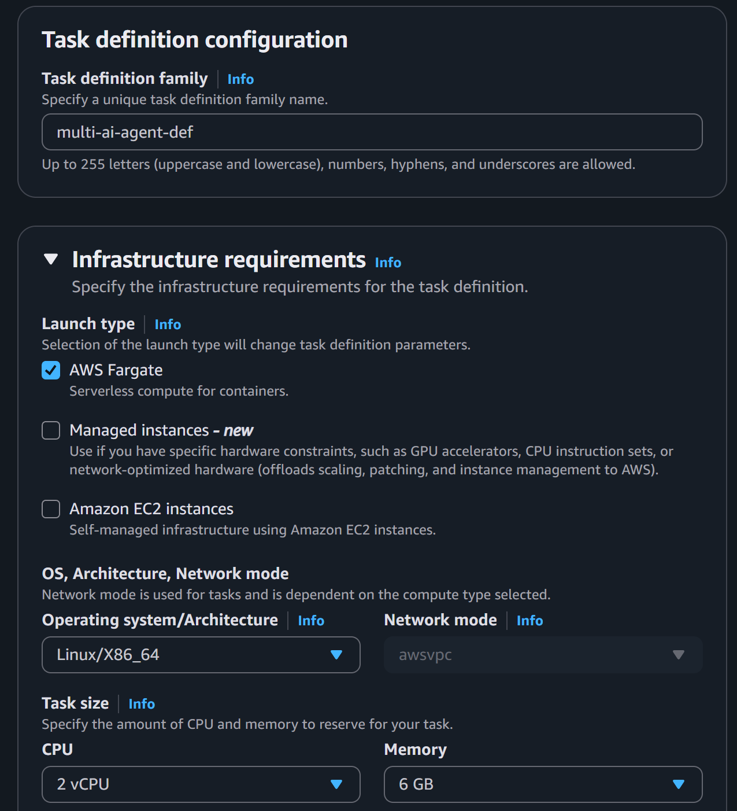
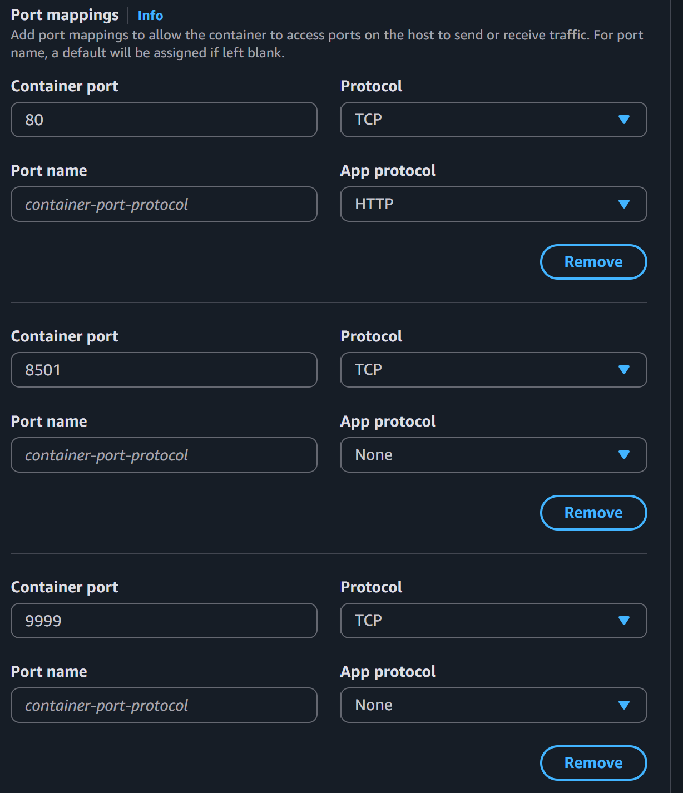
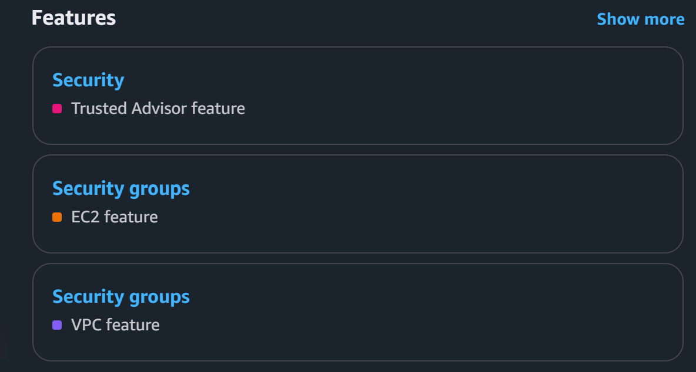
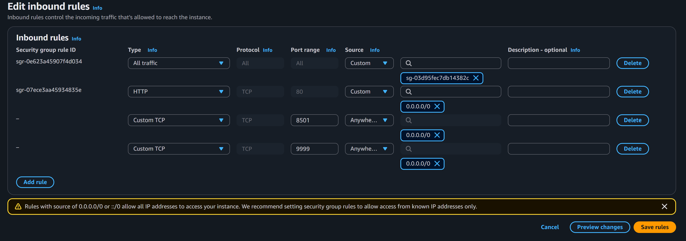
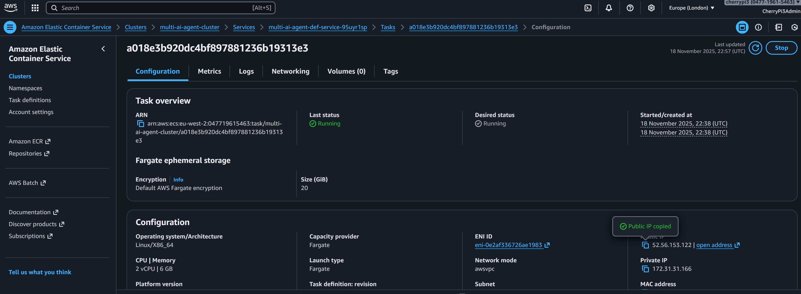
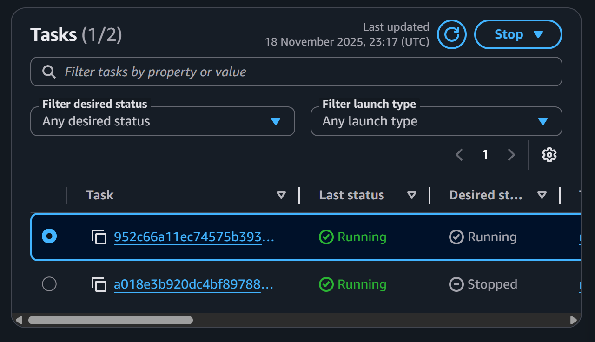

# 🌩️ **AWS ECS Fargate Deployment — LLMOps Multi-AI Agent**

This branch completes the final stage of the project: deploying the Multi-AI Agent application to **Amazon Web Services ECS Fargate**, fully automated via the Jenkins pipeline.

You will take the Docker image already pushed to Amazon ECR and deploy it into a serverless container environment, exposing both the **Streamlit UI (8501)** and the **FastAPI backend (9999)**.

This README walks through the entire deployment process with precise steps, AWS UI references, image screenshots, and the final cleanup instructions.

## 🧩 **What Was Added in This Branch**

* ECS cluster configuration
* ECS task definition using your ECR image
* Environment variables for GROQ + Tavily
* ECS service creation
* Security group updates
* Application deployment and verification
* Jenkins pipeline changes for ECS deployment
* Cleanup steps and shutdown


# 🚀 **1. Create ECS Cluster and Task Definition**

## Create ECS Cluster

Navigate in AWS to:

**Elastic Container Service (ECS) → Clusters → Create Cluster**

Give your cluster a name, for example:

```
multi-ai-agent-cluster
```

Select:

```
Fargate only
```


Click **Create**.

## Create ECS Task Definition

Navigate to:

**ECS → Task Definitions → Create new Task Definition**

Choose:

```
Launch type: Fargate
```

Give it a name:

```
multi-ai-agent-def
```

Set CPU + Memory:

**2 vCPU**
**6 GB Memory**



Under **Container details**:

* Name: `llmops`
* Image: use your ECR image URL, such as:

```
047719615463.dkr.ecr.eu-west-2.amazonaws.com/my-repo:latest
```

### Configure port mappings

Add **two** mappings:

```
Port: 8501   Protocol: TCP
Port: 9999   Protocol: TCP
```



### Add Environment Variables

Scroll down → **Add environment variable**

Add:

```
Key: GROQ_API_KEY     Value: <your-value>
Key: TAVILY_API_KEY   Value: <your-value>
```

Click **Create**.


# 🛳️ **2. Create ECS Service**

Return to:

**Clusters → your cluster → Services → Create**

Select your task definition:

```
multi-ai-agent-def
```

Leave everything else **default**.

Click **Create**.


# 🔐 **3. Update Security Group Inbound Rules**

Search for:

```
Security Groups
```



Open the **default** security group → **Edit inbound rules**.

Add:

* Custom TCP → Port 8501 → Source: Anywhere
* Custom TCP → Port 9999 → Source: Anywhere



Save the rules.


# 🌍 **4. Access Your Deployed Application**

Once the service is running:

Go to:

**Cluster → Service → Tasks → Click running task**

Find **Public IP**:



Open:

```
http://<PUBLIC-IP>:8501/
```

Example:

```
http://52.56.153.122:8501/
```

Your app should now load.


# 👤 **5. Add ECS Permissions to IAM User**

Go to:

**IAM → Users → multi-ai-agent → Add Permissions**

Attach:

```
AmazonECS_FullAccess
```


# 🧪 **6. Update Jenkins Pipeline (Final Stage)**

In your **Jenkinsfile**, uncomment the final stage and update it with your:

* AWS region
* ECS cluster name
* ECS service name

Example:

```groovy
aws ecs update-service \
  --cluster multi-ai-agent-cluster \
  --service multi-ai-agent-def-service-shqlo39p \
  --force-new-deployment \
  --region eu-west-2
```

Save and push your changes to GitHub.

Run your Jenkins pipeline again.
Jenkins will now trigger a **new ECS deployment**.


# 🔄 **7. Verify Deployment**

Return to:

**ECS → Cluster → Tasks**

You should now see:

* old task → **STOPPED**
* new task → **RUNNING**



Copy the **new public IP**, and open the app in your browser.


# 🎉 **8. Project Complete**

Your entire Multi-AI Agent system is now:

* containerised
* stored in ECR
* deployed via ECS Fargate
* automatically redeployed through Jenkins

This completes the cloud deployment pipeline.


# 🧼 **9. Cleanup Instructions**

Delete the ECS cluster and ECR repository in AWS.

Then in **WSL terminal** run:

```bash
docker system prune -a --volumes -f
docker stop jenkins-dind
docker stop sonarqube-dind

docker rm jenkins-dind
docker rm sonarqube-dind
docker rm -f jenkins-dind sonarqube-dind

docker rmi jenkins-dind
docker rmi sonarqube:latest

docker volume rm jenkins_home
docker volume prune -f

docker network rm dind-network
docker builder prune -a -f
```

Everything is now fully cleaned.
