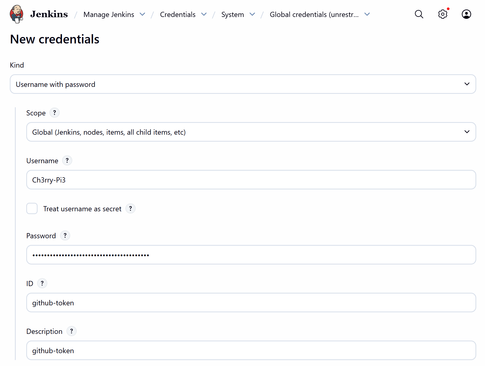
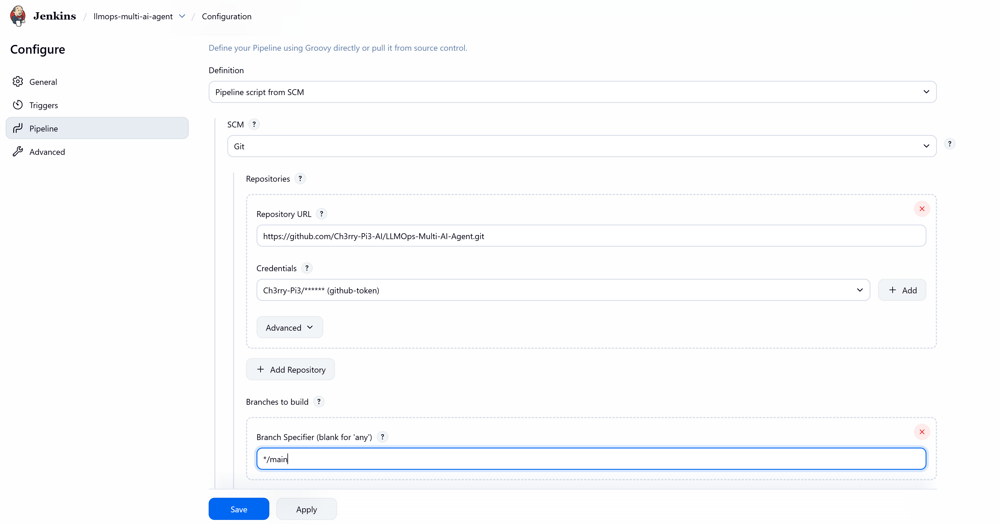

# 🔗 **GitHub Integration with Jenkins — LLMOps Multi-AI Agent**

This branch introduces full **GitHub → Jenkins integration**, enabling automated pipeline execution directly from your GitHub repository.
You will create a GitHub personal access token, add it to Jenkins, configure a Pipeline job, generate the checkout script, create the initial Jenkinsfile, and run your first successful build.

## 🧩 **What Was Added in This Branch**

* GitHub personal access token setup
* Jenkins credential configuration
* New Jenkins Pipeline job
* Checkout script generation using Pipeline Syntax
* Initial Jenkinsfile added to the repository
* First successful Jenkins pipeline run

## 🗂️ **Project Structure Update**

```text
LLMOPS-MULTI-AI-AGENT/
├── Jenkinsfile                       # NEW: Initial pipeline file for integration test
├── custom_jenkins/
│   └── Dockerfile
└── app/
    ├── backend/
    ├── common/
    ├── config/
    ├── core/
    ├── frontend/
    └── main.py
```

Only the Jenkinsfile is new in this branch.

## 1️⃣ Generate Your GitHub Personal Access Token

1. Go to GitHub
2. Open: Settings → Developer Settings → Personal Access Tokens → Classic
3. Click Generate New Token
4. Enable the following permissions:

   * repo
   * repo_hook
5. Generate the token
6. Copy it immediately (GitHub will not show it again)

## 2️⃣ Add Your GitHub Token to Jenkins

1. Open Jenkins Dashboard
2. Manage Jenkins → Manage Credentials → Global
3. Add Credentials
4. Fill in:

   * Username: your GitHub username
   * Password: your GitHub token
   * ID: github-token
   * Description: github-token
5. Save

<p align="center">
  
</p>

## 3️⃣ Create a Jenkins Pipeline Job

1. Go to Jenkins Dashboard
2. Click New Item
3. Choose Pipeline
4. Enter a name and click OK

<p align="center">
  
</p>

Scroll down and add your GitHub repo URL (from the green “<> Code” button):

<p align="center">
  
</p>

Click Apply and Save.

## 4️⃣ Generate Your Checkout Script

Inside the Jenkins job:

1. Click Pipeline Syntax
2. Under Step, select “checkout”
3. Fill in:

   * Repository URL
   * Credentials → github-token
4. Generate the Pipeline Script
5. Copy the output

This is the script Jenkins auto-generates for checking out your repo via Git.

## 5️⃣ Create or Modify Your Jenkinsfile (VS Code)

In your cloned repo:

1. Open the Jenkinsfile in VS Code
2. Keep only the **first stage** (“Checkout”)
3. Comment out:

   * The environment block
   * Every other stage
4. Keep the final two closing curly braces
5. Paste the generated checkout script into lines 55–60 (your current placeholder)

This gives you the simplest possible pipeline:
Just a GitHub checkout to confirm integration is working.

Commit and push the Jenkinsfile to GitHub.

## 7️⃣ Run the Pipeline

1. Return to Jenkins
2. Open your Pipeline job
3. Click Build Now
4. Wait for the run to complete

## 8️⃣ Verify Success

A successful run will show:

* A green checkmark / blue icon
* A populated Workspace containing your GitHub repository files

This confirms Jenkins can successfully authenticate with GitHub and clone your project.

## ✅ Summary

This branch establishes GitHub → Jenkins integration, including:

* Personal access token creation
* Secure credential storage
* Jenkins Pipeline job setup
* Jenkinsfile added to the repository
* First successful build with GitHub checkout

This lays the groundwork for full CI/CD automation such as SonarQube scans, Docker builds, ECR pushes, and ECS deployments in future branches.