# 📊 **SonarQube Setup & Jenkins Integration — LLMOps Multi-AI Agent**

This branch introduces **SonarQube-based code quality analysis** and integrates it with the existing **Jenkins CI/CD pipeline**.

You will:

* Run SonarQube using Docker on WSL
* Install and configure SonarQube plugins in Jenkins
* Create a local project and token in SonarQube
* Configure SonarQube server and scanner inside Jenkins
* Add a SonarQube stage to the Jenkinsfile
* Connect Jenkins and SonarQube containers via a shared Docker network
* Run the pipeline and inspect code quality results in SonarQube

## 🗂️ **Project Structure Update**

No new tracked files are added in this branch.
The main change is an **updated Jenkinsfile** that now includes a **SonarQube analysis stage**.

```text
LLMOPS-MULTI-AI-AGENT/
├── Jenkinsfile                   # UPDATED: SonarQube analysis stage added
├── Dockerfile
├── custom_jenkins/
│   └── Dockerfile
└── app/
    ├── backend/
    ├── common/
    ├── config/
    ├── core/
    ├── frontend/
    └── main.py
```

All other changes are environment and service configuration (SonarQube + Jenkins).

## 1️⃣ Download and Run SonarQube Docker Container

1. Go to DockerHub: [https://hub.docker.com/](https://hub.docker.com/)
2. Search for **SonarQube**

<p align="center">
  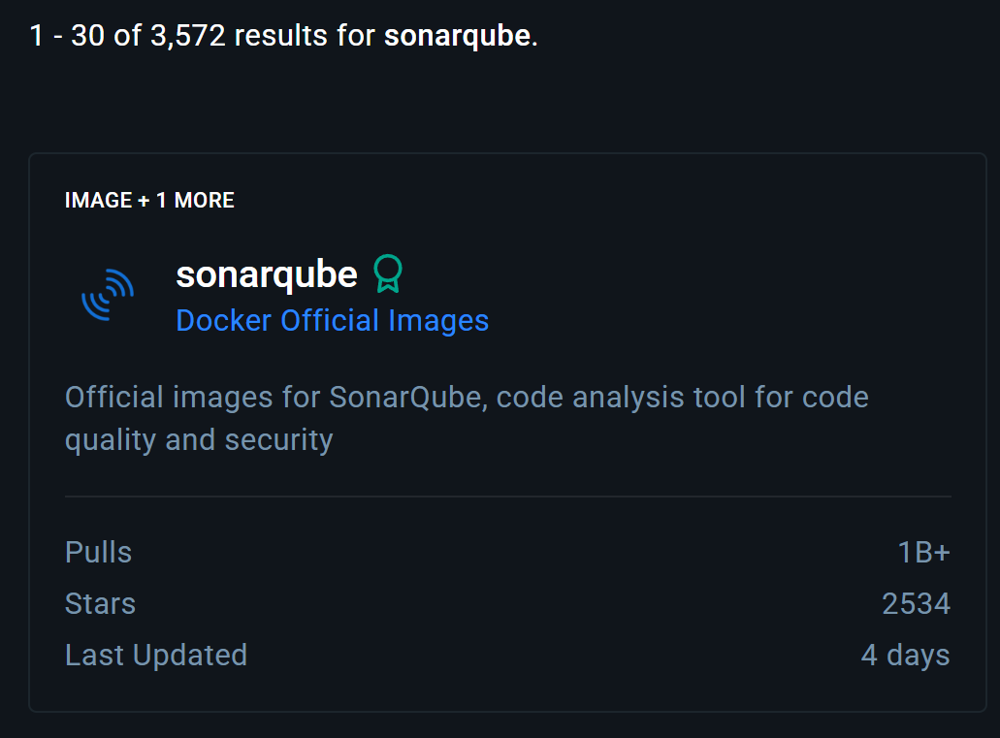
</p>

Scroll down to find the Docker run command section.

In a **new WSL terminal** (Ubuntu in VS Code), run the following commands one by one to configure system limits:

```bash
sysctl -w vm.max_map_count=524288
sysctl -w fs.file-max=131072
ulimit -n 131072
ulimit -u 8192
```

Then go to the official SonarQube Docker docs:
[https://docs.sonarsource.com/sonarqube-server/try-out-sonarqube](https://docs.sonarsource.com/sonarqube-server/try-out-sonarqube)

From that page, locate the Docker command:

<p align="center">
  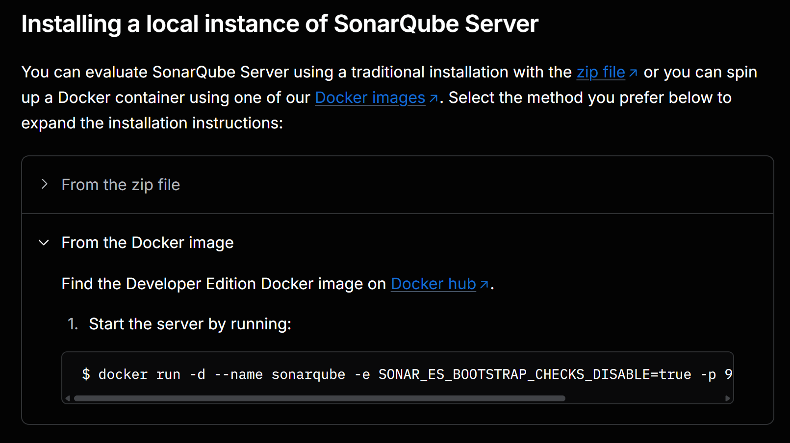
</p>

The base command from the docs is:

```bash
docker run -d --name sonarqube -e SONAR_ES_BOOTSTRAP_CHECKS_DISABLE=true -p 9000:9000 sonarqube:latest
```

Modify it to use a **custom container name**:

```bash
docker run -d --name sonarqube-dind -e SONAR_ES_BOOTSTRAP_CHECKS_DISABLE=true -p 9000:9000 sonarqube:latest
```

Run this command in your WSL terminal.

Example output:

```text
Unable to find image 'sonarqube:latest' locally
latest: Pulling from library/sonarqube
4f4fb700ef54: Pull complete
4a0e444f3c26: Pull complete
0b92fa77023f: Pull complete
1321ce5b3e3a: Pull complete
8fd6319e1acb: Pull complete
f878172f1ac3: Pull complete
f0e656fd3d7c: Pull complete
20043066d3d5: Pull complete
Digest: sha256:48dd0e946ad6481dde43bb31d1a7af09c22f59be6399b195dcce7b87d82c5f40
Status: Downloaded newer image for sonarqube:latest
9eca6e2749e6d61032c056302783826913cb326d9e75abbd1a7f4b16e1f6b57f
```

Now, access SonarQube at:

```text
http://<WSL_IP>:9000
```

Replace `<WSL_IP>` with your actual WSL IP address.

<p align="center">
  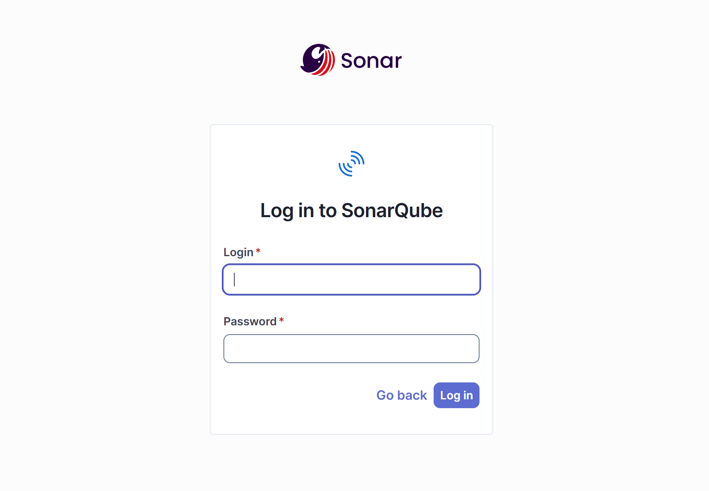
</p>

Log in with the default credentials:

```text
Username: admin
Password: admin
```

After login, you’ll see the SonarQube landing page:

<p align="center">
  
</p>

## 2️⃣ Install Jenkins Plugins for SonarQube

In Jenkins:

1. Go to **Manage Jenkins → Manage Plugins**
2. Install the following plugins:

   * **SonarScanner**
   * **SonarQualityGates**

<p align="center">
  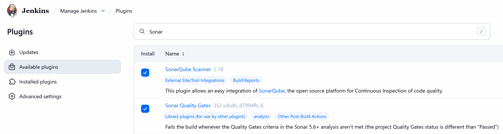
</p>

Restart the Jenkins container to apply changes:

```bash
docker restart jenkins-dind
```

## 3️⃣ Create a Local Project and Token in SonarQube

In the SonarQube UI:

1. On the landing page, click **Create a local project** at the bottom
2. Enter a project name and continue
3. Choose **Follows the instance's default**
4. Click **Create**

<p align="center">
  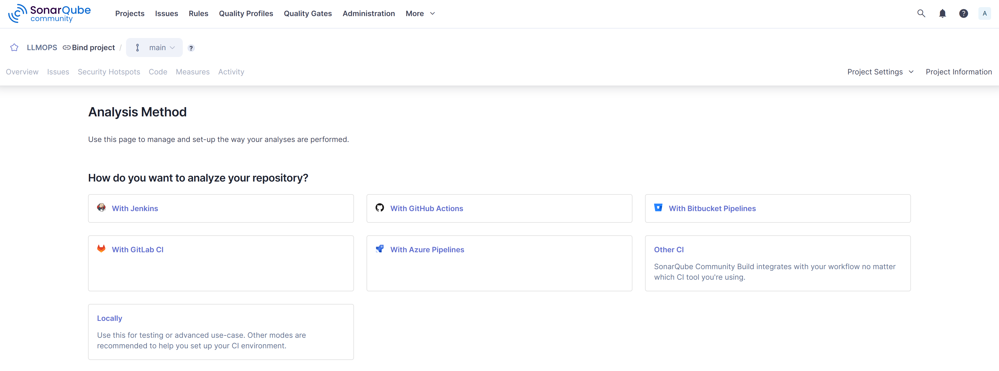
</p>

Now generate a token:

1. Go to **My Account** (top-right avatar)
2. Navigate to the **Security** tab
3. Click **Generate new token**

<p align="center">
  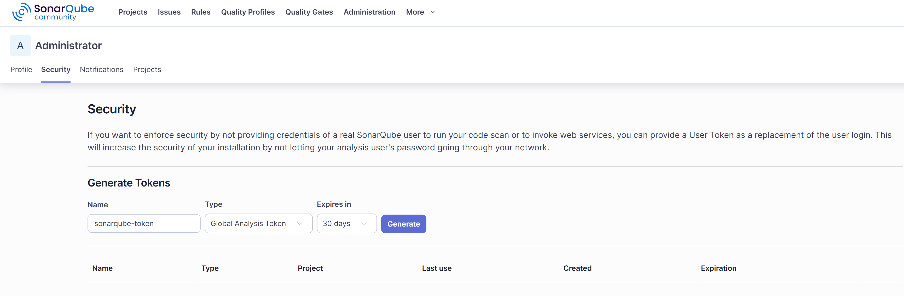
</p>

Copy the generated token and keep it safe.

## 4️⃣ Add SonarQube Token to Jenkins

In Jenkins:

1. Go to **Manage Jenkins → Credentials → Global**
2. Click **Add Credentials**
3. Choose **Secret text**
4. Set:

   * **ID:** `sonarqube-token`
   * **Secret:** paste the token from SonarQube
5. Click **OK** to save

This credential will be used by the Jenkins pipeline for authentication.

## 5️⃣ Configure SonarQube Server in Jenkins

In Jenkins:

1. Go to **Manage Jenkins → System Configuration**
2. Scroll to **SonarQube servers**
3. Click **Add SonarQube**

Fill in:

* **Name:** `Sonarqube` (or another label you prefer)
* **URL:** `http://<WSL_IP>:9000` (using your actual WSL IP at first)
* **Server authentication token:** choose the `sonarqube-token` credential

<p align="center">
  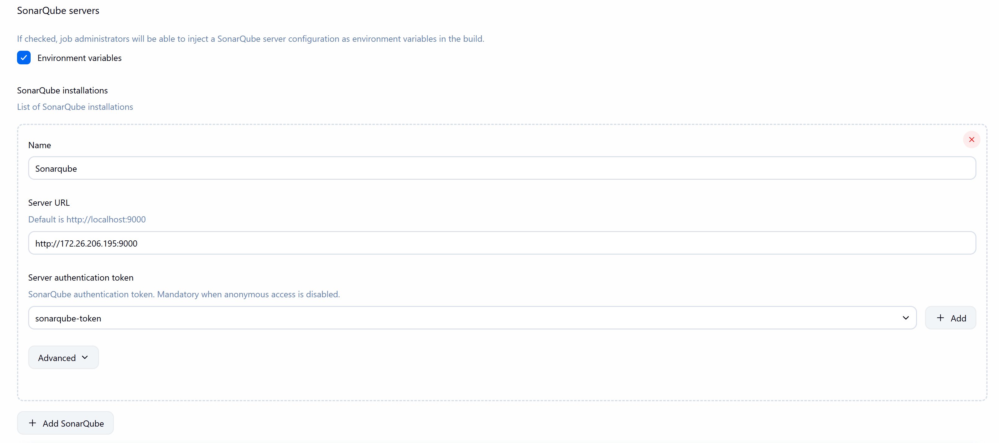
</p>

Click **Apply** then **Save**.

## 6️⃣ Configure SonarQube Scanner in Jenkins

In Jenkins:

1. Go to **Manage Jenkins → Tools**
2. Locate **SonarQube Scanner**
3. Click **Add SonarQube Scanner**
4. Provide a name (e.g. `Sonarqube`)
5. Tick **Install automatically**

<p align="center">
  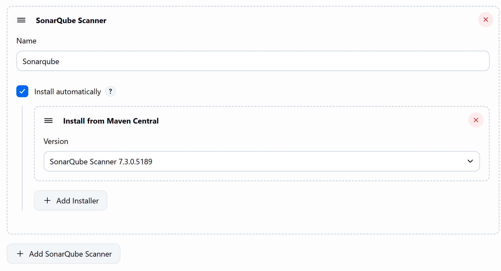
</p>

Click **Apply** and **Save**.

## 7️⃣ Add SonarQube Stage to Jenkinsfile

In your project:

1. Open the **Jenkinsfile** in VS Code
2. Add (or ensure you have) the **SonarQube analysis stage**, using:

   * `withSonarQubeEnv('Sonarqube')`
   * `${SONAR_SCANNER_HOME}`
3. Commit and push the updated Jenkinsfile to your GitHub repository

This stage is already present in your current code and uses:

```groovy
-Dsonar.host.url=http://sonarqube-dind:9000
```

which will be wired up in the next step using Docker networking.

## 8️⃣ Create Docker Network for Jenkins and SonarQube

To allow Jenkins (inside `jenkins-dind`) to reach SonarQube (inside `sonarqube-dind`) using container names:

Create a dedicated Docker network:

```bash
docker network create dind-network
```

Attach both containers to this network:

```bash
docker network connect dind-network jenkins-dind
docker network connect dind-network sonarqube-dind
```

Now Jenkins can reach SonarQube via:

```text
http://sonarqube-dind:9000
```

This is why the Jenkinsfile uses:

```groovy
-Dsonar.host.url=http://sonarqube-dind:9000
```

Restart the Jenkins container:

```bash
docker restart jenkins-dind
```

## 9️⃣ Run the Pipeline and Inspect Results in SonarQube

Back in Jenkins:

1. Open your pipeline job
2. Click **Build Now**
3. Wait for the pipeline to complete successfully

Once the build finishes, go to your **SonarQube UI → Projects**.
You should see a successful analysis:

<p align="center">
  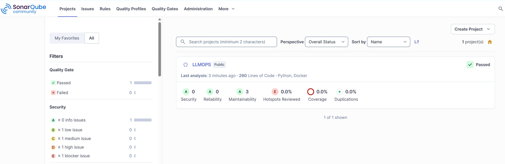
</p>

Click on your project to inspect overall code quality:

<p align="center">
  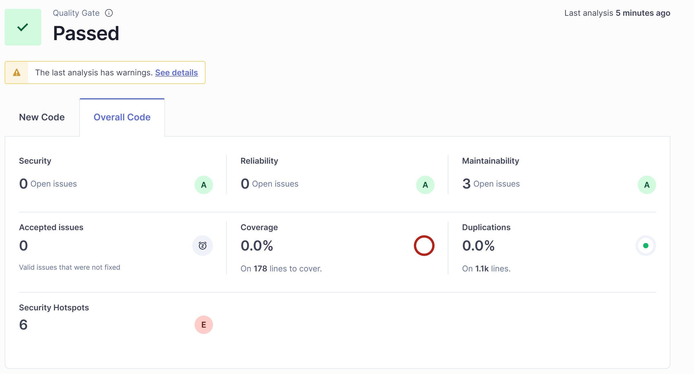
</p>

You can drill down into individual files to identify code quality issues:

<p align="center">
  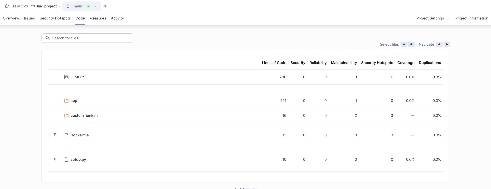
</p>

## ✅ Summary

This branch establishes:

* A working **SonarQube instance** running in Docker on WSL
* Jenkins plugins for SonarQube analysis and quality gates
* A **local SonarQube project** and authentication token
* Full **SonarQube server + scanner configuration** in Jenkins
* A dedicated Docker network linking `jenkins-dind` and `sonarqube-dind`
* A **SonarQube analysis stage** in the Jenkinsfile
* Successful quality analysis visible in the SonarQube UI

Your CI pipeline now not only builds and deploys, but also continuously evaluates **code quality** using SonarQube.
