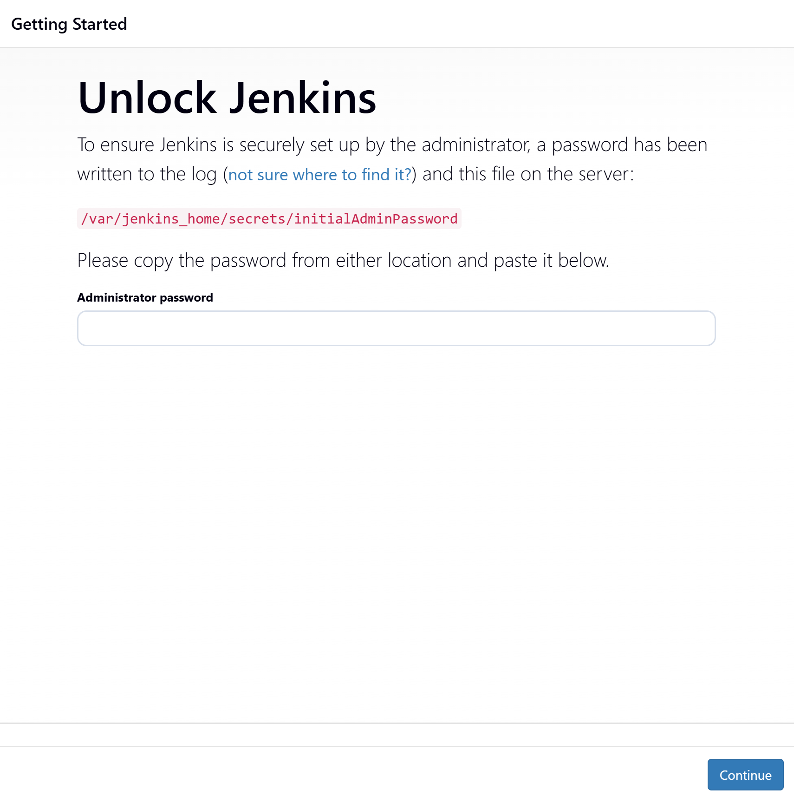
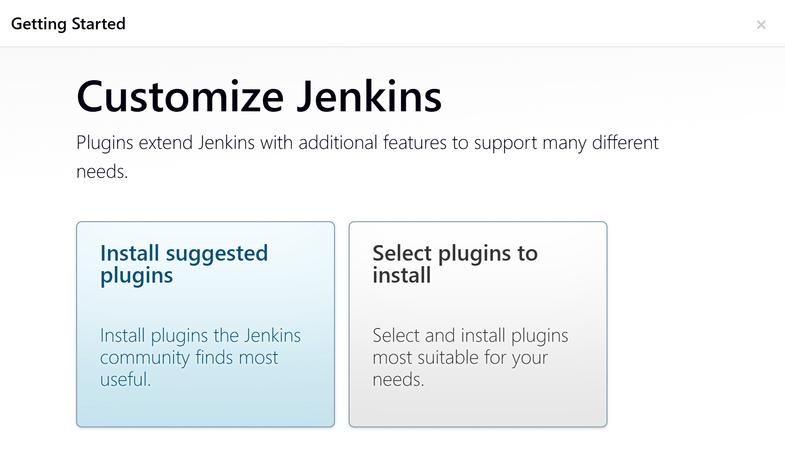
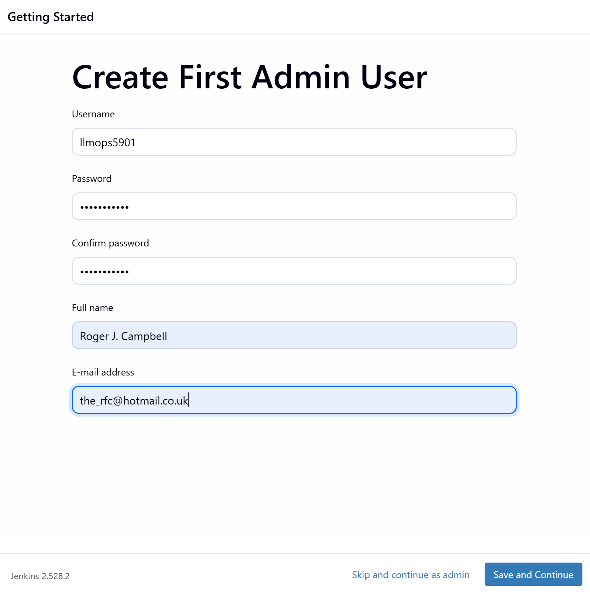
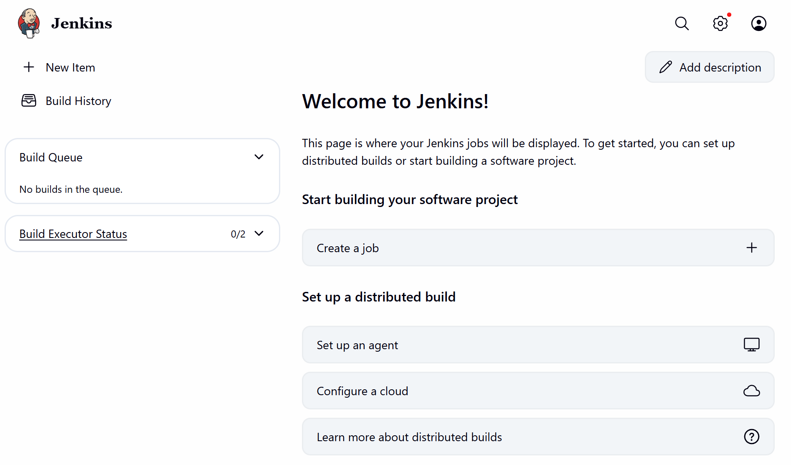

# 🔧 **Jenkins Setup (Docker-in-Docker) — LLMOps Multi-AI Agent**

This branch introduces the full Jenkins CI/CD setup for the Multi-AI Agent project.
Two Dockerfiles were created:

* A **root Dockerfile** for the application
* A **custom Jenkins Dockerfile** inside `custom_jenkins/` enabling **Docker-in-Docker (DinD)**

This setup allows Jenkins to build and push Docker images, run containers, and execute CI pipelines entirely from inside Jenkins itself.

The instructions below walk through building the custom Jenkins image, running it, retrieving the admin password, accessing Jenkins via WSL IP, installing plugins, creating the admin user, and adding Python inside the Jenkins container.

## 🧩 **What Was Added in This Branch**

* `Dockerfile` in project root
* `custom_jenkins/Dockerfile`
* Jenkins DinD build + run instructions
* Setup workflow using WSL + VS Code
* Images demonstrating Unlock, Plugin Install, Admin Creation, Dashboard

## 🗂️ **Project Structure Update**

```text
LLMOPS-MULTI-AI-AGENT/
├── Dockerfile
├── custom_jenkins/
│   └── Dockerfile              # NEW: Jenkins DinD-enabled custom image
│
└── app/
    ├── main.py
    ├── backend/
    ├── common/
    ├── config/
    ├── core/
    └── frontend/
```

Only the **custom Jenkins Dockerfile** is new in this branch.

## 🚀 **1️⃣ Build the Jenkins DinD Image**

Open a **new Ubuntu (WSL)** terminal inside VS Code.

Navigate to the custom_jenkins folder:

```bash
cd custom_jenkins
```

Build the Docker image:

```bash
docker build -t jenkins-dind .
```

Output:

```
[+] Building 63.9s (8/8) FINISHED docker:default
 => [internal] load build definition from Dockerfile                                                                     0.0s
 => [internal] load metadata for docker.io/jenkins/jenkins:lts                                                           0.9s
 => [internal] load .dockerignore                                                                                        0.0s
 => CACHED [1/4] FROM docker.io/jenkins/jenkins:lts                                                                      0.0s
 => [2/4] RUN apt-get update ...                                                                                        34.7s
 => [3/4] RUN groupadd ...                                                                                               0.4s
 => [4/4] RUN mkdir -p /var/lib/docker                                                                                   0.3s
 => exporting to image                                                                                                  27.4s
 => naming to docker.io/library/jenkins-dind:latest                                                                      0.0s
 => unpacking to docker.io/library/jenkins-dind:latest
```

## 🚀 **2️⃣ Run the Jenkins DinD Container**

```bash
docker run -d --name jenkins-dind \
  --privileged \
  -p 8080:8080 -p 50000:50000 \
  -v /var/run/docker.sock:/var/run/docker.sock \
  -v jenkins_home:/var/jenkins_home \
  jenkins-dind
```

Example output (container ID):

```
0671f2a573cafc964c591d347b2cdb1b3dbac21a63b414820d536af917be1ed7
```

Check if the container is running:

```bash
docker ps
```

Output:

```
CONTAINER ID   IMAGE          COMMAND                  CREATED              STATUS              PORTS                                                      NAMES
0671f2a573ca   jenkins-dind   "/usr/bin/tini -- /u…"   About a minute ago   Up About a minute   0.0.0.0:8080->8080/tcp ...                                 jenkins-dind
```

## 🔑 **3️⃣ Retrieve Jenkins Initial Admin Password**

```bash
docker logs jenkins-dind
```

Output:

```
*************************************************************
Jenkins initial setup is required...
Please use the following password to proceed:
d81300af6fe545baa08d2219c02748b3
*************************************************************
```

Copy this password.

## 🌐 **4️⃣ Find Your WSL IP Address**

```bash
ip addr show eth0 | grep inet
```

Output:

```
inet 172.26.206.195/20 brd 172.26.207.255 scope global eth0
inet6 fe80::215:5dff:fe32:30a/64 scope link
```

Use this IP address to access Jenkins:

```
http://172.26.206.195:8080
```

## 🔓 **5️⃣ Unlock Jenkins**

<p align="center">
  
</p>

Enter the initial admin password you copied earlier.

## 🔌 **6️⃣ Install Suggested Plugins**

<p align="center">
  
</p>

Select **Install suggested plugins**.

## 👤 **7️⃣ Create the First Admin User**

<p align="center">
  
</p>

Then continue to the dashboard.

## 🏠 **8️⃣ Jenkins Dashboard**

<p align="center">
  
</p>

Your Jenkins controller is now running.

## 🐍 **9️⃣ Install Python Inside Jenkins Container**

Open a shell into the Jenkins container:

```bash
docker exec -u root -it jenkins-dind bash
```

Inside the container:

```bash
apt update -y
apt install -y python3
python3 --version
ln -s /usr/bin/python3 /usr/bin/python
python --version
apt install -y python3-pip
exit
```

Restart the container:

```bash
docker restart jenkins-dind
```

Now log back into Jenkins via the browser.

## ✅ **Summary**

This branch introduces:

* A full Docker-in-Docker Jenkins setup
* A custom Jenkins image capable of running Docker builds
* Step-by-step instructions with inputs, outputs, and images
* Python installed inside Jenkins for pipeline scripting
* A reproducible workflow for launching Jenkins inside WSL2

Your CI/CD foundation for the Multi-AI Agent project is now fully operational.
