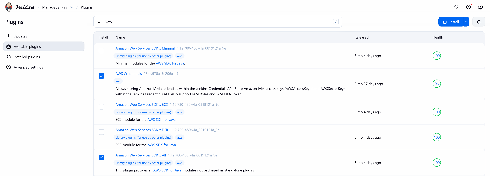
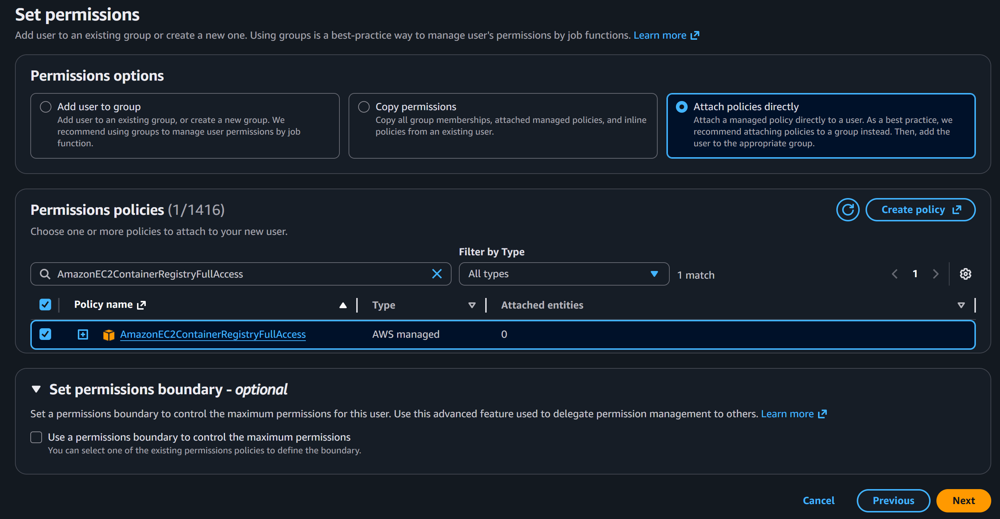
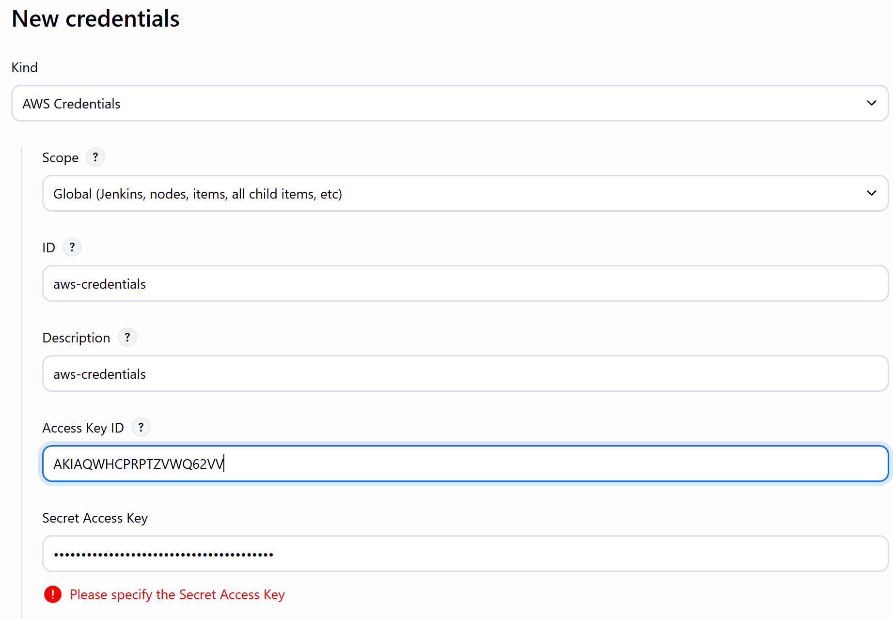
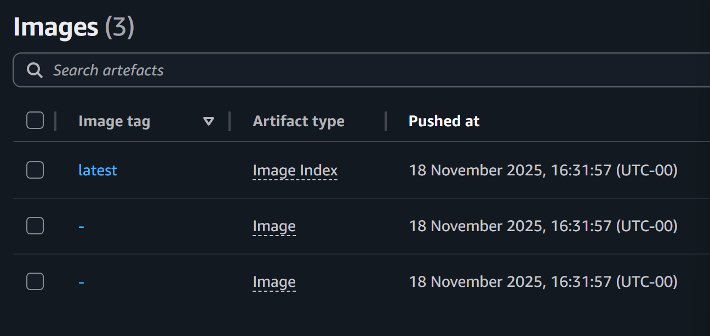

# ☁️ **AWS Integration & ECR Deployment — LLMOps Multi-AI Agent**

This branch introduces **AWS integration** into the CI/CD pipeline.
Jenkins is now able to:

* Authenticate with AWS
* Build Docker images
* Push those images to **Amazon Elastic Container Registry (ECR)**
* Trigger ECS deployment (via later stages)

This stage focuses on configuring all AWS components, updating Jenkins, and verifying that a full **“Build → Tag → Push”** Docker workflow succeeds.

## 🗂️ **Project Structure Update**

No new files were added to the codebase for this branch.
The primary change is an **update to the Jenkinsfile**, specifically the stage:

```
Build and Push Docker Image to ECR
```


# 1️⃣ Install Required Jenkins Plugins

Inside Jenkins:

1. Go to **Manage Jenkins → Manage Plugins**
2. Search for and install:

* **Amazon Web Services SDK :: All**
* **AWS Credentials**

<p align="center">
  
</p>

Restart your Jenkins container:

```bash
docker restart jenkins-dind
```


# 2️⃣ Install AWS CLI Inside the Jenkins Container

Open your WSL terminal, then navigate to your `custom_jenkins` folder:

```bash
cd custom_jenkins
```

Enter the Jenkins container as **root**:

```bash
docker exec -u root -it jenkins-dind bash
```

Update package lists and install tools:

```bash
apt update
apt install -y unzip curl
```

Download and install AWS CLI:

```bash
curl "https://awscli.amazonaws.com/awscli-exe-linux-x86_64.zip" -o "awscliv2.zip"
unzip awscliv2.zip
./aws/install
```

Verify installation:

```bash
aws --version
```

Expected output:

```
aws-cli/2.31.38 Python/3.13.9 Linux/6.6.87.2-microsoft-standard-WSL2 exe/x86_64.debian.13
```

Exit the container:

```bash
exit
```

Restart Jenkins again:

```bash
docker restart jenkins-dind
```


# 3️⃣ Create IAM User for Jenkins (AWS Access)

Go to AWS Console → **IAM → Users → Create User**

Name the user:

```
multi-ai-agent
```

Choose **Attach policies directly**, then attach:

* AmazonEC2ContainerRegistryFullAccess

<p align="center">
  
</p>

Create the user, then create an **Access Key**:

* Choose: **Command Line Interface (CLI)**
* Click **Create**

Copy:

* Access Key ID
* Secret Access Key

You’ll need these for Jenkins.


# 4️⃣ Add AWS Credentials to Jenkins

Go to:

**Jenkins Dashboard → Manage Jenkins → Manage Credentials → Global**

Add a **new credential**:

* Kind: **AWS Credentials**
* ID: `aws-token`
* Access Key ID: *(paste from AWS)*
* Secret Access Key: *(paste from AWS)*

<p align="center">
  
</p>

Save.


# 5️⃣ Create an ECR Repository

In AWS Console:

1. Go to **ECR (Elastic Container Registry)**
2. Click **Create Repository**
3. Name it:

```
my-repo
```

Save the repository URL — it will follow this pattern:

```
<aws-account-id>.dkr.ecr.<region>.amazonaws.com/my-repo
```


# 6️⃣ Update Jenkinsfile for AWS Build + Push Stage

Update the environment block:

```groovy
AWS_REGION = 'eu-west-2'   // example for London region
ECR_REPO   = 'my-repo'
IMAGE_TAG  = 'latest'
```

The “Build & Push Docker Image to ECR” stage is already present, but make sure it references your repo & region.

Restart Jenkins to apply changes:

```bash
docker restart jenkins-dind
```


# 7️⃣ Push Changes to GitHub and Run Pipeline

Commit and push your updated Jenkinsfile:

```bash
git add Jenkinsfile
git commit -m "Add AWS ECR deployment stage"
git push
```

This triggers Jenkins (if webhooks are configured), or run manually:

1. Open Jenkins dashboard
2. Select your pipeline
3. Click **Build Now**

If the build & push succeed, go to **AWS Console → ECR → Repositories → my-repo**
You should see:

<p align="center">
  
</p>

Your `latest` tag may show two manifests (`-` entries) — this is normal for multi-architecture Docker images.


# ✅ Summary

This branch completes the following:

* Installed AWS plugins in Jenkins
* Installed AWS CLI inside `jenkins-dind`
* Created IAM user + credentials
* Added AWS credentials to Jenkins
* Created ECR repository
* Updated Jenkinsfile to build, tag, and push Docker images
* Verified images successfully appear in ECR

Your Jenkins pipeline is now fully capable of pushing Docker images to AWS ECR.


# 🛠️ Troubleshooting — Docker Permissions with Jenkins DinD

Below is the **exact troubleshooting section** you asked to include.

### Why errors happened

Most failures were caused by:

```
permission denied while trying to connect to the docker API at unix:///var/run/docker.sock
```

This comes from one of two places:

1. Your **WSL host user** cannot access Docker
2. The **jenkins user inside the jenkins-dind container** cannot access Docker

Fix both and the pipeline succeeds.

## 1️⃣ Fix WSL Host-Level Permissions

Run these in **WSL**, not inside Docker.

### Diagnose

Check groups:

```bash
groups
```

Check socket:

```bash
ls -l /var/run/docker.sock
```

You want:

```
srw-rw---- 1 root docker ... /var/run/docker.sock
```

Test Docker:

```bash
docker ps
```

If you get a permission error: fix the socket.

### Fix

```bash
sudo chown root:docker /var/run/docker.sock
sudo chmod 660 /var/run/docker.sock
```

Verify:

```bash
docker ps
```

If this works, host-level permissions are now correct.


## 2️⃣ Fix Jenkins Container Permissions

Enter container as **jenkins**:

```bash
docker exec -u jenkins -it jenkins-dind bash
```

Check:

```bash
whoami
id
ls -l /var/run/docker.sock
docker ps
```

If you see something like:

* jenkins in group ID 995
* docker.sock owned by group 989

then Jenkins cannot talk to Docker because group IDs don't match.

### Fix group mismatch

Enter container as **root**:

```bash
docker exec -u root -it jenkins-dind bash
```

Fix the `docker` group to match the socket:

```bash
groupmod -g 989 docker
usermod -aG docker jenkins
chown root:docker /var/run/docker.sock
chmod 660 /var/run/docker.sock
```

Restart:

```bash
exit
docker restart jenkins-dind
```

### Verify again as jenkins:

```bash
docker exec -u jenkins -it jenkins-dind bash
docker ps
```

If it works without error —
your Jenkins pipeline can now run Docker builds successfully.

